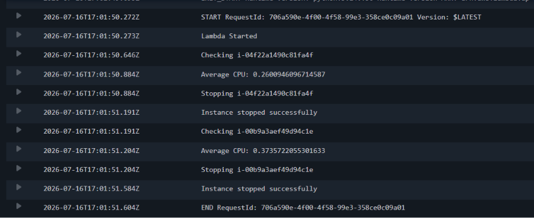

# 💰 Automated Cost Optimizer

An intelligent AWS Cost Optimization solution built using **AWS Lambda, Amazon EC2, Amazon CloudWatch, Amazon EventBridge Scheduler and Amazon S3*. The system automatically monitors EC2 CPU utilization, stops idle instances to reduce cloud costs, stores optimization logs in cloudwatch.

---

## 🚀 Live Demo

**Hosted on EC2**

```
http://13.206.70.48
```

---

# 📸 Screenshots

## Dashboard


---

## CloudWatch Monitoring



---

# ✨ Features

- Automatically monitors EC2 CPU utilization
- Stops idle EC2 instances automatically
- Reduces unnecessary AWS costs
- Scheduled monitoring using EventBridge
- Stores optimization logs in DynamoDB
- Live Cost Optimizer Dashboard
- Displays CPU utilization history
- Shows instance status (Running/Stopped)
- CloudWatch Monitoring Integration

---

# 🏗 Architecture

```
                CloudWatch Metrics
                     │
                     ▼
            CPU Utilization Check
                     │
                     ▼
          CloudWatch Scheduled Event
          (Runs every 15 minutes)
                     │
                     ▼
              AWS Lambda Function
                     │
        ┌────────────┴────────────┐
        │                         │
CPU < 5% for idle instance?       No
        │                         │
       Yes                        ▼
        │                   Do Nothing
        ▼
 Stop EC2 Instance
        │
        ▼
 CloudWatch Logs```

---

# 🛠 AWS Services Used

- Amazon EC2
- AWS Lambda
- Amazon CloudWatch
- Amazon EventBridge Scheduler
- Amazon S3
- IAM

---

# 💻 Tech Stack

### Backend

- Python
- AWS Lambda
- Boto3

### Cloud

- Amazon EC2
- Amazon CloudWatch
- Amazon EventBridge Scheduler
- Amazon S3
- IAM

---

# 📁 Project Structure

```
Automated-Cost-Optimizer
│

├── lambda
│   ├── cost_optimizer.py
│   └── get_logs.py
│
├── screenshots
│   ├── dashboard.png
│   ├── logs.png
│   └── cloudwatch.png
│
└── README.md
```

---

# ⚙️ API Endpoints

## Get Optimization Logs

```
GET /logs
```

Response

```json
[
  {
    "InstanceId": "i-0181a2c37a5f6595b",
    "CPU": "0.13",
    "Action": "Stopped",
    "Timestamp": "2026-07-16 12:45:15"
  }
]
```

---

## Health Check

```
GET /
```

---

# ⚙️ How It Works

1. EventBridge Scheduler triggers AWS Lambda every 15 minutes.
2. Lambda checks CPU utilization of running EC2 instances using CloudWatch.
3. If average CPU utilization is below the configured threshold (5%), Lambda automatically stops the EC2 instance.
4. Optimization details are stored in Amazon DynamoDB.
5. API Gateway exposes REST APIs to fetch optimization logs.
6. The S3-hosted dashboard displays optimization history and instance information.

---

# 🌐 Deployment

The frontend is hosted as a static website on Amazon S3.

AWS Lambda performs automated monitoring and optimization.

Amazon EventBridge Scheduler invokes the Lambda function every 15 minutes.

---

# 🔐 IAM Permissions

The Lambda execution role has permissions to:

- ec2:DescribeInstances
- ec2:StopInstances
- cloudwatch:GetMetricStatistics
- dynamodb:PutItem
- dynamodb:Scan
- logs:CreateLogGroup
- logs:CreateLogStream
- logs:PutLogEvents

---

# 📦 Installation

Clone the repository

```bash
git clone https://github.com/your-username/Automated-Cost-Optimizer.git
```

Go to the project

```bash
cd Automated-Cost-Optimizer
```

Deploy the Lambda functions.

Create the DynamoDB table.

Configure the EventBridge Scheduler.

Create API Gateway.

Host the frontend on Amazon S3.

Update the API endpoint inside `script.js`.

---

# 🚀 Future Improvements

- Amazon SNS Email Notifications
- EC2 Auto Start Scheduler
- Tag-based Instance Filtering
- Estimated AWS Cost Savings
- CloudWatch Dashboard Integration
- AWS Cost Explorer Integration
- Multi-Region Monitoring
- Role-Based User Authentication
- Dark Mode Dashboard
- Real-Time Auto Refresh
- Grafana Integration

---

# 👨‍💻 Author

**Pranav Chopade**


---

# ⭐ If you like this project

Give this repository a ⭐ on GitHub.
